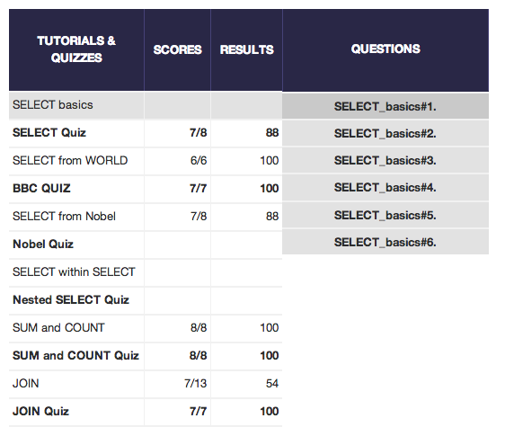

## U3.W7: SQLZoo

####I worked on this challenge [by myself].

### My Quiz Results:

### Reflection

## What parts of your strategy worked? What problems did you face?

When I started this challenge, I started out just trying to answer the questions and only look up relevant keywords, as I thought this would be the most time efficient way.  After a while though, I felt like I wasn't really learning the material by just searching, so I went through some of the w3schools SQL tutorial first, which helped solidify the material.

## What questions did you have while coding? What resources did you find to help you answer them?

I was totally unfamiliar with SQL before this, so I basically went through the suggested resources and videos.  I relied heavily on the tutorial from w3schools.

## What concepts are you having trouble with, or did you just figure something out? If so, what?

I didn't realize that the order of the commands in SQL really mattered and got stuck for a bit before I noticed that the logical order of my steps didn't quite follow.

## Did you learn any new skills or tricks?

SQL is totally new to me, so I guess I started learning that!

## How confident are you with each of the Learning Competencies?

I'm not too confident with the learning competencies as they're all new to me.  I hope that with practice I'll get stronger with them!

## Which parts of the challenge did you enjoy?

I enjoyed learning something new and solving the each step of the tutorials and quizzes.

## Which parts of the challenge did you find tedious?

I really don't like watching videos to learn things, so going through some of the suggested resource videos was pretty tedious.